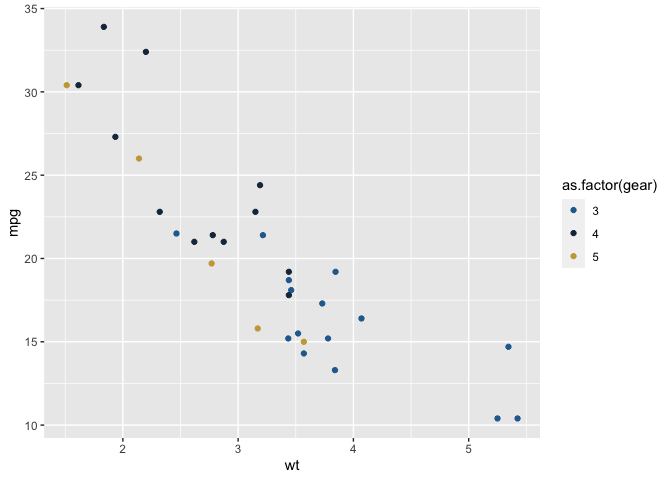

<!-- README.md is generated from README.Rmd. Please edit that file -->

# blair

<!-- badges: start -->
<!-- badges: end -->

This is my personal package to organize functions I often find myself
going back and copy pasting so that 1) I amd using the same versions
across projects and 2) reproducibility.

## Installation

You can install the development version of blair from
[GitHub](https://github.com/) with:

``` r
# install.packages("devtools")
devtools::install_github("sophiebmoore00/blair")
```

## Example

For example, I save color palettes I like to `palettes()`, and the
available palette names can be found with `get_palettes()`

``` r
library(blair)

get_palettes()
#> [1] "one, two, blues"

palettes("blues")
#> [1] "#1b667e" "#548ea3" "#45b4d4" "#99d6e6" "#dce4ec"
palettes("one")
#> [1] "#246B9E" "#16324a" "#C9A646" "#C96552" "#E7CBA9"
```

And the palettes can be used to easily color plots:

``` r
library(ggplot2)
ggplot(mtcars, aes(x = wt, y = mpg, color = as.factor(gear))) +
  geom_point() +
  scale_color_manual(values = palettes("one"))
```


